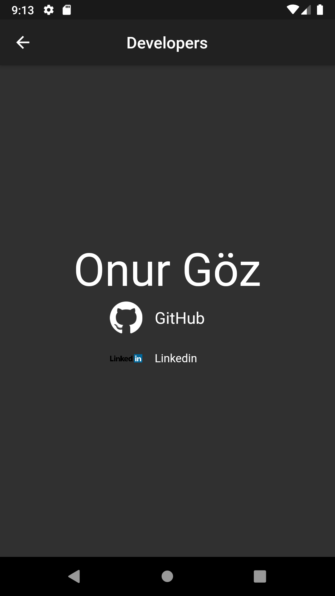
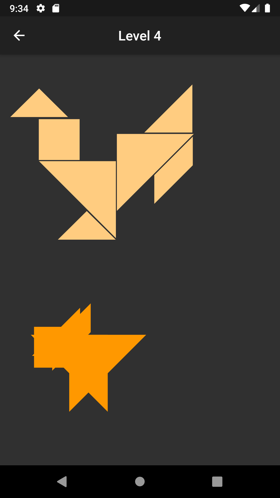

# Tangram App

## What is a TANGRAM?

Tangram is a creative intelligence game on the basis of creating various forms by combining seven geometrically shaped pieces made of stone, bone, plastic or wood.

## How do i play

You can level up by placing the pieces given for placement in appropriate places.
There are 9 levels, 3 easy, 3 medium and 3 hard.

## Plugins

Tangram App is currently extended with the following plugins.
Instructions on how to use them in your own application are linked below.

| Plugin | README |
| ------ | ------ |
| [flutter_launcher_name](https://pub.dev/packages/flutter_launcher_name) | [flutter_launcher_name README](https://github.com/daisuke-fukuda/flutter_launcher_name/blob/master/README.md)|
| [url_launcher](https://pub.dev/packages/url_launcher) | [flutter_launcher_name README](https://github.com/flutter/plugins/blob/master/README.md) |

## Screenshots
### Home Page

### Developer Page

### Help Page

### Level 1

### Level 2

### Level 3

### Level 4

### Level 5

### Level 6

### Level 7

### Level 8

### Level 9

